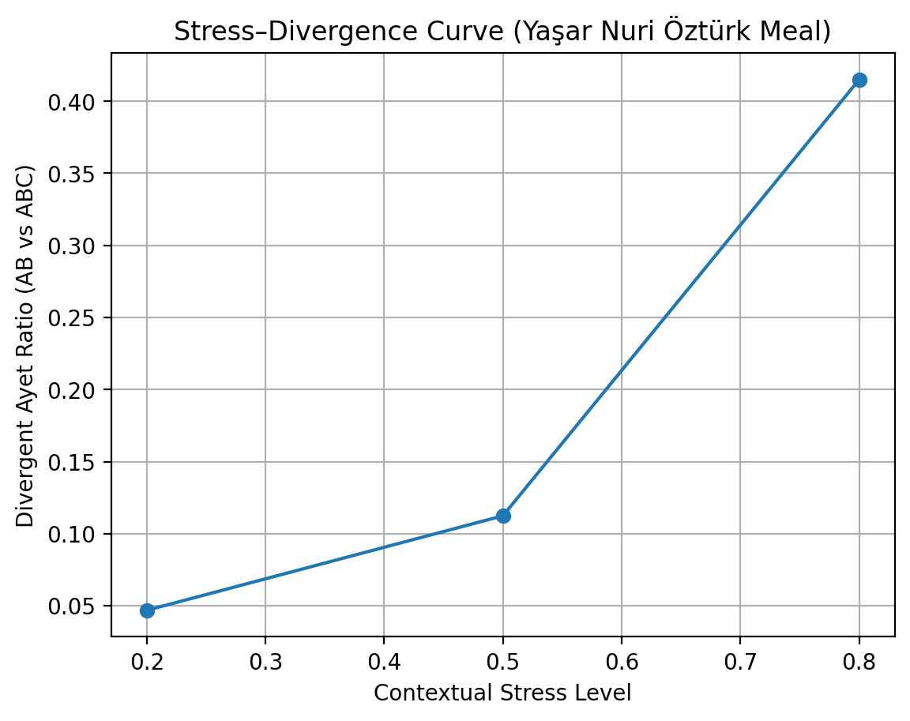

# Stress-Adaptive Semantic Control in NK-Ops  
*Lexeme-Level and Text-Level Evidence*

## 1. Motivation

Most contemporary NLP systems operate on tokens and vector embeddings.
While highly effective at pattern matching, these systems lack an explicit
mechanism for **"behavioral adaptation under contextual stress**.

In natural language, stress is not merely emotional intensity; it represents
conditions such as conflict, polemic load, normative pressure, or epistemic risk.
Human language adapts under such conditions by **modulating expression**:
asserting, softening, or remaining silent.

The central question explored here is:

> Can a semantic system adapt its behavior under stress without introducing
> an explicit internal state variable?

NK-Ops answers this question negatively.

---

## 2. AB vs ABC Representation

NK-Ops models linguistic units as *Marbles* operating in distinct semantic fields:

- **A-field (Meaning):** semantic proximity and conceptual anchoring  
- **B-field (Structure):** morphological and operational stability  
- **C-field (Orientation / Consciousness):** intentional drive and contextual stance  

Two representations are compared:

- **AB:** Meaning + Structure (token + morphology equivalent)
- **ABC:** Meaning + Structure + Orientation (stress-aware state)

The hypothesis is simple:

> If C is a genuine degree of freedom, AB and ABC should diverge
> systematically under stress.

---

## 3. Lexeme-Level Stress Experiment (Summary)

At the lexeme level, 354 AB–ABC paired candidates were evaluated under three
stress conditions (0.2, 0.5, 0.8).

Observed behavior followed a consistent phase pattern for ABC marbles:

Low stress → ASSERT  
Medium stress → SOFT  
High stress → SILENCE  

AB marbles, lacking a C-field, collapsed rapidly into silence as stress increased.

This experiment established **stress-adaptive behavior at the word level**.
The next step was to verify whether this behavior persists at **text scale**.

---

## 4. Text-Level Evidence: Yaşar Nuri Öztürk Meal

To test contextual preservation, the same stress logic was applied at the
**ayet (sentence) level** using the Yaşar Nuri Öztürk Qur’an translation
(6,236 ayets).

All runs used identical tokens, deterministic scoring, and identical aggregation
rules, with **stress as the only varying parameter**.

### Divergent Ayet Rates (AB vs ABC)

| Stress Level | Divergent Ayets | Ratio |
|-------------|-----------------|-------|
|     0.2     |    292 / 6236   |  4.7% |
|     0.5     |    701 / 6236   | 11.2% |
|     0.8     |   2588 / 6236   | 41.5% |

**Key observation:**

> Divergence grows monotonically with contextual stress, despite identical tokens
> and deterministic scoring.

This confirms that the lexeme-level stress signature is **preserved and amplified**
at the text level.

*Figure: Ayet-level AB–ABC divergence increases monotonically with contextual stress
(Yaşar Nuri Öztürk meal, 6,236 ayets).*

---

## 5. Why Marble Is Required

The observed divergence cannot be attributed to token variation, embedding noise,
heuristic randomness, or author style (single-author controlled).

The only structural difference between AB and ABC representations is the
presence of the **C-field**.

Therefore:

> Stress-adaptive semantic behavior requires an explicit internal state variable.

Token-based and embedding-only architectures lack such a variable by design.
The Marble abstraction provides it naturally.

---

## 6. Status and Next Steps

**Current status:**
- Lexeme-level stress adaptation: verified  
- Text-level preservation (single author): verified  

**Planned work:**
- Multi-author (all meals) generalization  
- Replacement of deterministic mock scoring with full NK-Ops field scoring  
- Visualization of stress–divergence phase transitions  

---

## Conclusion

NK-Ops demonstrates that semantic systems can exhibit
**stress-adaptive behavior** only when equipped with an explicit orientation field.

This behavior is observable, measurable, and preserved across linguistic scales.

The Marble model is therefore not an implementation detail,
but a structural necessity.
